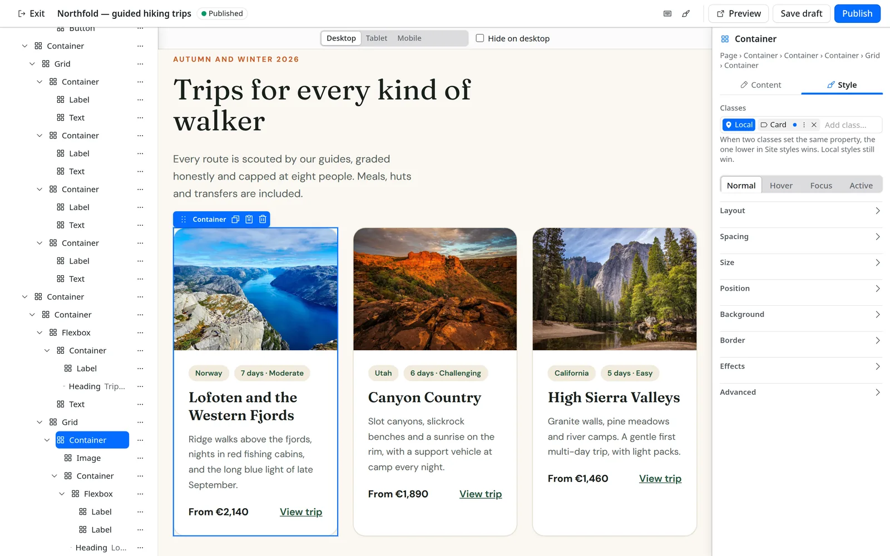

# EmVB

[](https://emvb.dev) [](https://www.npmjs.com/package/@perkyzz/emvb)

A visual page builder plugin for [EmDash CMS](https://github.com/emdash-cms/emdash) 1.0–1.2. Pages are built in a full-screen editor inside the EmDash admin and published as plain HTML and CSS. The public site loads no EmVB JavaScript except the optional popups, floats, tabs and menu scripts, and only on pages that use them. Forms use the forms plugin's own script. It runs on Node (SQLite) and Cloudflare Workers (D1).

**Website:** <https://emvb.dev>.

**Status:** 0.3.0 is on npm as [`@perkyzz/emvb`](https://www.npmjs.com/package/@perkyzz/emvb). This repository's main is ahead of that release (schema 14, see the Unreleased section of [CHANGELOG.md](CHANGELOG.md)). The MVP (implementation slices S1–S6) is complete.



## Features

- **Editor:** drag, drop and nest elements; edit text on the canvas; copy, paste, undo and redo; preview desktop, tablet and mobile.
- **Elements:** containers (flexbox or CSS Grid), sections, headings, text, lists, links, buttons, images, video, icons (a library of about 14,400 from Lucide, Font Awesome Free, Tabler and Remix; see [the icon library guide](docs/guides/icon-library.md)), dividers, spacers, tabs, accordions, menus, popups, floating bars, forms, loops, pagination, and post fields for theme templates.
- **Styling:** Hover, Focus and Active states with transitions, per-device styles and hide on device, backgrounds (image, video, gradient, overlay), entrance animations and scroll motion, custom attributes.
- **Site styles:** variables (including fluid type and spacing), classes in a clear priority order, tag defaults, text direction, changes staged until **Publish styles**, import and export as JSON.
- **Theme Builder:** headers, footers, Error 404, Search Results, Single Page, Single Post, Archive, Loop Item, synced sections, page templates, popups and floating bars, with display conditions.
- **Live data and personalization:** bind text and images to a post, a site setting or a URL parameter; collection Loops; visitor rules (country, device, new or returning, hours, and segments the host passes); edge A/B tests decided on the server.

More screenshots are in [`site/public/screenshots/`](site/public/screenshots/), and the project site in `site/` shows them all.

## Quick start

Needs [Bun](https://bun.sh) and Node. Both demo dev servers and Playwright run on Node. Verified with Bun 1.4.2 and Node 24.21. End-to-end tests use the system Chromium at `/usr/bin/chromium`, or the binary in `EMVB_CHROMIUM`.

```bash
bun install
bun run check        # lint, format, types, dead code, unit and Astro tests
bun run demo:node    # Node demo on http://127.0.0.1:4411
```

1. Sign in to the demo admin (dev only): <http://127.0.0.1:4411/_emdash/api/setup/dev-bypass?redirect=/_emdash/admin>
2. Open **Pages VisualBuilder** and click **Set up EmVB**.
3. Click **New page**, edit the heading, and **Publish**. The page is served at `http://127.0.0.1:4411/<slug>`.

The Cloudflare demo runs the same way with `bun run demo:cf` on port 4412.

## Use it in your EmDash site

```bash
npm i @perkyzz/emvb
```

Register it next to your other EmDash plugins in `astro.config.mjs`:

```js
import { emvb } from "@perkyzz/emvb";

export default defineConfig({
  integrations: [
    emdash({
      plugins: [emvb()],
      // …database, storage…
    }),
  ],
});
```

Then add the public route and run **Set up EmVB** once, as [docs/guides/install-in-a-host-site.md](docs/guides/install-in-a-host-site.md) describes. The demos in `demos/node` and `demos/cloudflare` are complete host sites; their `src/pages/[slug].astro` shows the public route.

## Development and testing

| Task                                                           | Command                                                      |
| -------------------------------------------------------------- | ------------------------------------------------------------ |
| Lint, format, types, dead code, unit and Astro tests           | `bun run check`                                              |
| Unit tests only                                                | `bun run test`                                               |
| End to end, both demos (Playwright)                            | `bun run e2e`                                                |
| Public pages on production builds                              | `bun run e2e:prod`                                           |
| Seeded bugs (prove the tests catch real defects)               | `bun run seeded-bugs`                                        |
| Project site ([emvb.dev](https://emvb.dev), source in `site/`) | `bun run site` (http://127.0.0.1:4455), `bun run site:build` |

[CONTRIBUTING.md](CONTRIBUTING.md) covers setup, pull requests and troubleshooting, and [SECURITY.md](SECURITY.md) how to report a vulnerability.

## Docs

- [docs/system/layout-format.md](docs/system/layout-format.md): how pages and the design system are stored.
- [docs/system/theme-parts.md](docs/system/theme-parts.md): theme parts, conditions, triggers and dynamic data.
- [docs/guides/install-in-a-host-site.md](docs/guides/install-in-a-host-site.md): add EmVB to an EmDash site.
- [CHANGELOG.md](CHANGELOG.md).

## License

[MIT](LICENSE) © 2026 Charles Wilkin.

The Icon library uses icons from [Lucide](https://lucide.dev) (ISC), [Font Awesome Free](https://fontawesome.com) (icons [CC BY 4.0](https://creativecommons.org/licenses/by/4.0/), by Fonticons, Inc.), [Tabler Icons](https://tabler.io/icons) (MIT) and [Remix Icon](https://remixicon.com) 4.8.0 (Apache-2.0). See [packages/emvb/THIRD_PARTY_NOTICES.md](packages/emvb/THIRD_PARTY_NOTICES.md).
